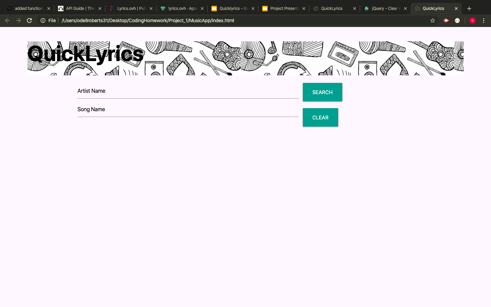
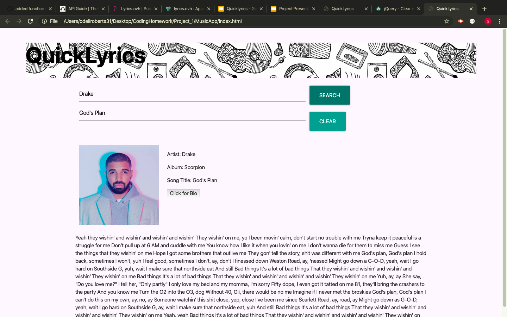
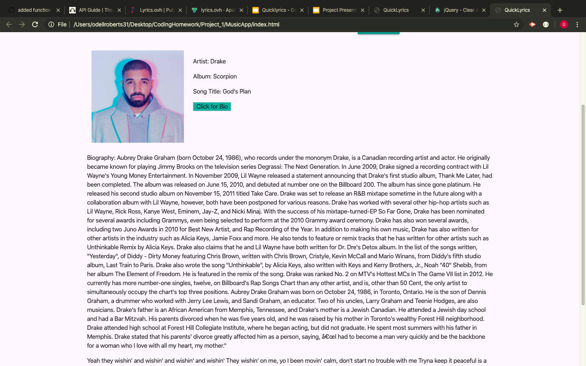

# MusicApp
Group project one. 

## QuickLyrics

For our project we decided to create a page where you could quickly look up lyrics to your favorite song.

Not only will you be able to view the lyrics to any approved song, you will be able to also view a picture of the artist and view the album from which the song is from if applicable.

Included in the song information area is a button to be able to view the biography of the selected artist, which will appear above the lyrics.

With our lyric feature you will need to know the name of the artist as well as the song title which needs to be entered in correctly.

Listed below are some screenshots of what to expect when using our page.

Below you will see a screenshot of the initial page once loaded.

Below is a screenshot of what you would typically see once you search for a song.

If you would like to see the biography of the artist, the screenshot below will show you what to expect once the "Click for Bio" button is clicked

